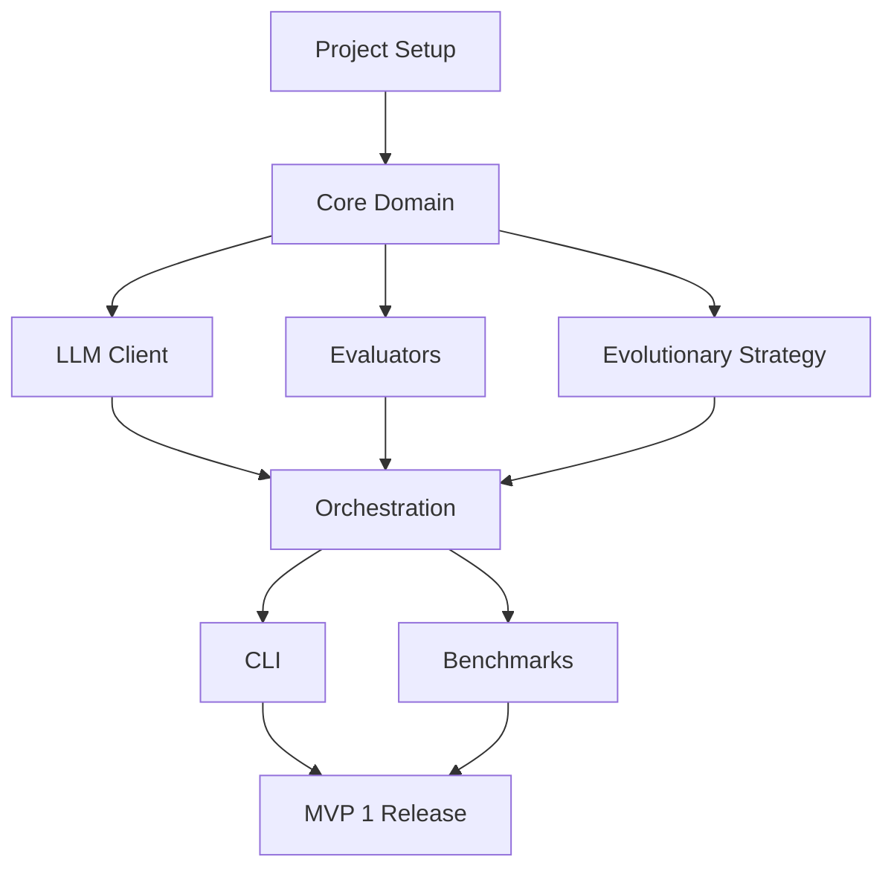

# PromptFoundry — Implementation Plan

> **Version:** 1.2.0  
> **Status:** MVP 1 Complete  
> **Last Updated:** 2026-03-06  
> **Authoritative Source:** This document is the single source of truth for development roadmap.

---

## 1. Overview

This document outlines the phased implementation plan for PromptFoundry. Development proceeds through multiple MVP versions, each delivering demonstrable value while building toward the complete system.

---

## 2. Product Strategy

PromptFoundry should not add search methods faster than it can prove they are useful. The next stage focuses on making one approach reliable:

1. Build strong evaluation signals first, especially cheap proxy metrics for tasks without exact answers.
2. Make runtime behavior explicit and configurable for slow local backends.
3. Prove one optimization method on a benchmark suite before expanding the search-method surface area.
4. Add new search methods only after the evolutionary baseline consistently beats manual prompt variants on representative tasks.

This means MVP 2 is no longer "more algorithms first". It is "evaluation quality + performance discipline first".

---

## 3. MVP Versions

### ✅ MVP 1: CLI Optimizer (Foundation) — COMPLETED
**Goal:** Working command-line tool with evolutionary optimization

**Timeline:** Week 1-3 (Completed)

**Deliverables:**
- ✅ Core domain models (Prompt, Task, Population, History)
- ✅ Evolutionary strategy with mutation/crossover/selection
- ✅ OpenAI-compatible LLM client with rate limiting
- ✅ Multiple evaluators (exact, fuzzy, regex, custom, composite)
- ✅ CLI interface with optimize, validate, report commands
- ✅ JSON output with results saving
- ✅ 3 benchmark tasks (sentiment, JSON formatting, arithmetic)

### MVP 2: Evaluation & Runtime Foundation
**Goal:** Make evolutionary optimization useful on slow local models and on tasks without exact ground-truth matching

**Primary user value:** Users can optimize format-heavy and extraction-heavy tasks without relying on brittle exact-match labels or hand-editing source defaults for performance.

**Success criteria:**
- End-to-end optimization works from YAML/CLI configuration alone
- Slow-local profile is supported explicitly (`population_size`, `max_concurrency`, patience, runtime budget)
- At least 3 cheap proxy metrics are available and documented
- Evolutionary search shows measurable improvement on at least 2 representative tasks:
  - structured extraction
  - format-constrained reasoning or QA

**Deliverables:**
- Runtime profiles and config-driven optimization controls
- Cheap proxy metrics:
  - output-shape / regex compliance
  - parser success / schema compliance
  - field coverage / keyword presence
  - token and latency penalties
- Staged evaluation pipeline: cheap filter -> richer scorer
- Better reporting for cancellations, failures, and no-signal runs
- Benchmark harness for quality, latency, and cost per generation

### MVP 3: Evolutionary Quality
**Goal:** Make one search method consistently competitive before broadening the strategy set

**Primary user value:** The evolutionary baseline produces repeatable improvements instead of random prompt churn.

**Success criteria:**
- Mutation operators outperform a manual baseline on the benchmark suite
- Diversity preservation and lineage reporting explain why improvements happened
- The optimizer avoids zero-signal runs when proxy metrics are available

**Deliverables:**
- Richer mutation operators (task-aware constraints, format directives, example-aware edits)
- Diversity controls and duplicate suppression
- Adaptive mutation schedules
- Ablation utilities for operator quality
- Benchmark-based acceptance gates for future strategy additions

### MVP 4: Additional Search Methods (Experimental)
**Goal:** Add alternative search methods only after the evolutionary baseline is benchmarked and stable

**Primary user value:** Users get method choice backed by benchmark evidence, not feature count.

**Deliverables:**
- Bayesian optimization as experimental strategy
- Grid/template search for bounded prompt spaces
- Side-by-side strategy comparison on common tasks
- Strategy selection guidance based on task type and runtime budget

### MVP 5: Interfaces & Workflow
**Goal:** Package the proven core into better user-facing workflows

**Deliverables:**
- Python library API
- Web UI for monitoring and task setup
- Task library and templates
- Save/load experiment presets
- Documentation website with benchmark-backed guidance

---

## 3. MVP 1 Detailed Plan — COMPLETED

### Phase 1.1: Project Setup ✅
- [x] Create project structure
- [x] Set up pyproject.toml with dependencies
- [x] Configure development tools (ruff, mypy, pytest)
- [x] Initialize git repository
- [x] Create CI/CD pipeline skeleton
- [x] Write documentation structure

### Phase 1.2: Core Domain ✅
- [x] Implement `Prompt` and `PromptTemplate` models
- [x] Implement `Example` and `Task` models
- [x] Implement `Individual` and `Population` models
- [x] Implement `OptimizationHistory` model
- [x] Define protocol interfaces (Strategy, Evaluator, LLMClient)
- [x] Write unit tests for all models (26 tests)

### Phase 1.3: LLM Client ✅
- [x] Implement `OpenAICompatClient` with httpx
- [x] Add retry logic with exponential backoff
- [x] Add rate limiting (TokenBucket algorithm)
- [x] Configure for local text-generation-webui
- [x] Write integration tests with mock server (16 tests)

### Phase 1.4: Evaluators ✅
- [x] Implement `ExactMatchEvaluator`
- [x] Implement `RegexEvaluator`
- [x] Implement `FuzzyMatchEvaluator`
- [x] Implement `CustomFunctionEvaluator`
- [x] Implement `CompositeEvaluator`
- [x] Add batch evaluation support
- [x] Write unit tests (25 tests)

### Phase 1.5: Evolutionary Strategy ✅
- [x] Implement mutation operators
  - Rephrase instruction
  - Add/remove constraint
  - Swap example order
  - Modify formatting hints
- [x] Implement crossover operators
  - Single-point crossover
  - Component mixing
- [x] Implement selection operators
  - Tournament selection
  - Elitism
- [x] Implement `GeneticAlgorithmStrategy`
- [x] Write strategy unit tests (8 tests)

### Phase 1.6: Orchestration ✅
- [x] Implement `Optimizer` controller
- [x] Implement optimization loop
- [x] Add checkpointing/resume
- [x] Add progress callbacks
- [x] Write orchestration tests (9 tests)

### Phase 1.7: CLI ✅
- [x] Implement `optimize` command with full integration
- [x] Implement `validate` command (config validation)
- [x] Implement `report` command (view history)
- [x] Implement `list-results` command
- [x] Add rich progress display
- [x] Create `__main__.py` for module execution

### Phase 1.8: Benchmarks ✅
- [x] Create sentiment classification task
- [x] Create JSON formatting task
- [x] Create arithmetic reasoning task
- [x] Create benchmark runner script
- [x] Document benchmark usage

**Total Tests:** 84 passing across 5 test files

---

## 5. MVP 2 Detailed Plan

### Phase 2.1: Runtime Controls (Day 1-2) ✅
- [x] Load optimization settings from YAML with clear CLI override precedence
- [x] Add runtime profile presets (`slow-local`, `balanced`, `throughput`)
- [x] Expose concurrency, patience, and budget controls in CLI and config
- [x] Write unit tests for config precedence and profile selection

### Phase 2.2: Cheap Proxy Metrics (Day 3-5) ✅
- [x] Implement output-shape / regex compliance evaluator improvements
- [x] Implement parser-success / schema-success evaluator
- [x] Implement field-coverage / required-key evaluator
- [x] Implement latency/token penalty metric (as length constraint)
- [x] Document when to use cheap metrics vs exact metrics

### Phase 2.3: Staged Evaluation Pipeline ✅
- [x] Add multi-stage evaluator pipeline support
- [x] Support cheap pre-filtering before expensive scorers
- [x] Support partial-credit aggregation
- [x] Write tests for stage ordering and fallback behavior (53 tests)

### Phase 2.4: Reporting & Diagnostics (Day 9-10)
- [ ] Report no-signal runs explicitly
- [ ] Persist enough detail to inspect interrupted runs
- [ ] Show latency/cost per generation in reports
- [ ] Add benchmark summary output for task/operator comparison

### Phase 2.5: Benchmark Gate (Day 11-14)
- [ ] Define benchmark suite for extraction, formatting, and constrained reasoning
- [ ] Establish minimum improvement thresholds over baseline prompts
- [ ] Freeze MVP 2 only when the evolutionary baseline clears benchmark gates

---

## 6. Technical Decisions

### 4.1 Language & Runtime
- **Python 3.10+**: Modern syntax, pattern matching, improved typing
- **Async I/O**: httpx for async HTTP, asyncio for concurrency
- **Type Safety**: Full type annotations, mypy strict mode

### 4.2 Key Libraries

| Library | Purpose | Rationale |
|---------|---------|-----------|
| `pydantic` | Data validation | Industry standard, great DX |
| `httpx` | HTTP client | Async support, modern API |
| `typer` | CLI | Simple, type-hint based |
| `rich` | Console output | Beautiful progress/tables |
| `pytest` | Testing | Fixtures, async support |
| `ruff` | Linting/formatting | Fast, replaces flake8+black |

### 4.3 Development Tools
- **ruff**: Linting and formatting
- **mypy**: Static type checking
- **pytest**: Testing framework
- **pytest-cov**: Coverage reporting
- **pre-commit**: Git hooks

---

## 7. Risk Mitigation

| Risk | Mitigation |
|------|------------|
| LLM API instability | Comprehensive retry logic, mock client for tests |
| Slow optimization convergence | Cheap proxy metrics, staged evaluation, benchmark gates |
| Complex mutation semantics | Improve one operator family at a time and prove value on benchmarks |
| Scope creep | Strict MVP boundaries, feature backlog |
| Performance depends on backend | Runtime profiles, explicit concurrency controls, framework-overhead targets |

---

## 8. Quality Gates

### Per-MVP Gates

| Gate | Criteria |
|------|----------|
| Tests | All tests pass, >80% coverage |
| Types | mypy passes with no errors |
| Lint | ruff passes with no warnings |
| Docs | All public APIs documented |
| Demo | End-to-end demo works |
| Benchmarks | MVP-specific benchmark gates are met before next search method is added |

### MVP Acceptance Gates

| MVP | Gate |
|-----|------|
| MVP 2 | Cheap-metric pipeline improves at least 2 benchmark tasks with config-only tuning |
| MVP 3 | Evolutionary search beats manual baseline on the benchmark suite consistently |
| MVP 4 | New strategy is added only if it beats or complements the evolutionary baseline on benchmarks |

### Release Checklist
- [ ] All quality gates pass
- [ ] CHANGELOG updated
- [ ] Version bumped
- [ ] Demo script verified
- [ ] Documentation reviewed

---

## 9. Development Workflow

### Branch Strategy
```
main ─────────────────────────────────────────▶
  │
  ├── develop ─────────────────────────────────▶
  │     │
  │     ├── feature/core-models
  │     ├── feature/llm-client
  │     └── feature/evolutionary-strategy
  │
  └── release/mvp-1
```

### Commit Convention
```
<type>(<scope>): <description>

Types: feat, fix, docs, style, refactor, test, chore
Scope: core, llm, strategy, evaluator, cli, docs
```

---

## 8. Milestones

| Milestone | Target Date | Deliverable |
|-----------|-------------|-------------|
| M1: Setup Complete | Day 2 | Project skeleton, CI, docs structure |
| M2: Core Domain | Day 5 | Models, protocols, unit tests |
| M3: LLM Integration | Day 7 | Working LLM client |
| M4: Evaluation | Day 9 | Working evaluators |
| M5: Evolution | Day 14 | Working GA strategy |
| M6: MVP 1 Complete | Day 21 | CLI, benchmarks, demo |

---

## 9. Dependencies Between Tasks



---

## 10. Documentation Requirements

Each phase must include:
- API documentation (docstrings)
- Usage examples
- Test documentation
- CHANGELOG entry

---

## 11. Revision History

| Version | Date | Author | Changes |
|---------|------|--------|---------|
| 1.0.0 | 2026-03-06 | Initial | Document created |
