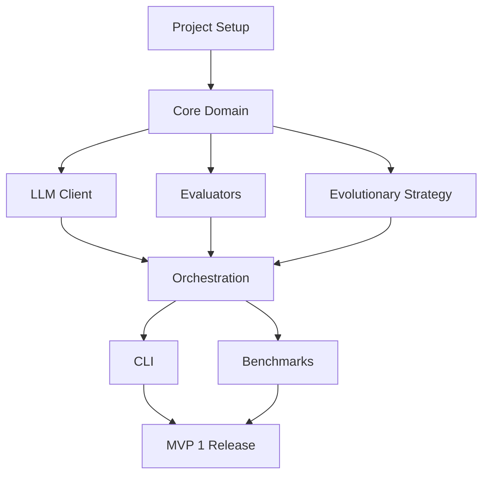

# PromptFoundry — Implementation Plan

> **Version:** 1.0.0  
> **Status:** Active  
> **Last Updated:** 2026-03-06  
> **Authoritative Source:** This document is the single source of truth for development roadmap.

---

## 1. Overview

This document outlines the phased implementation plan for PromptFoundry. Development proceeds through multiple MVP versions, each delivering demonstrable value while building toward the complete system.

---

## 2. MVP Versions

### MVP 1: CLI Optimizer (Foundation)
**Goal:** Working command-line tool with evolutionary optimization

**Timeline:** Week 1-3

**Deliverables:**
- Core domain models (Prompt, Task, Population)
- Evolutionary strategy with mutation/crossover
- OpenAI-compatible LLM client
- Exact match evaluator
- CLI interface with basic commands
- JSON/CSV output
- 3-5 benchmark tasks

### MVP 2: Extended Search & Reporting
**Goal:** Multiple strategies, richer evaluation, better reports

**Timeline:** Week 4-6

**Deliverables:**
- Bayesian optimization strategy (Optuna)
- Grid search strategy
- Fuzzy match, JSON schema, regex evaluators
- Composite objective support
- Performance visualization
- Ablation analysis
- Python library API

### MVP 3: Web UI & Task Library
**Goal:** Visual interface, pre-built tasks

**Timeline:** Week 7-9

**Deliverables:**
- Gradio/Streamlit web interface
- Real-time optimization visualization
- Pre-built task templates
- Save/load configurations
- Budget-aware optimization
- Documentation website

### MVP 4: Advanced Features
**Goal:** Production-ready with advanced capabilities

**Timeline:** Week 10-12

**Deliverables:**
- Human-in-loop feedback
- Multi-stage prompt chains
- Domain-specific operators
- Plugin architecture
- Comprehensive benchmarks

---

## 3. MVP 1 Detailed Plan

### Phase 1.1: Project Setup (Day 1-2)
- [x] Create project structure
- [x] Set up pyproject.toml with dependencies
- [x] Configure development tools (ruff, mypy, pytest)
- [x] Initialize git repository
- [x] Create CI/CD pipeline skeleton
- [x] Write documentation structure

### Phase 1.2: Core Domain (Day 3-5)
- [ ] Implement `Prompt` and `PromptTemplate` models
- [ ] Implement `Example` and `Task` models
- [ ] Implement `Individual` and `Population` models
- [ ] Implement `OptimizationHistory` model
- [ ] Define protocol interfaces (Strategy, Evaluator, LLMClient)
- [ ] Write unit tests for all models

### Phase 1.3: LLM Client (Day 6-7)
- [ ] Implement `OpenAICompatClient` with httpx
- [ ] Add retry logic with exponential backoff
- [ ] Add rate limiting
- [ ] Configure for local text-generation-webui
- [ ] Write integration tests with mock server

### Phase 1.4: Evaluators (Day 8-9)
- [ ] Implement `ExactMatchEvaluator`
- [ ] Implement `RegexEvaluator`
- [ ] Implement `CustomFunctionEvaluator`
- [ ] Add batch evaluation support
- [ ] Write unit tests

### Phase 1.5: Evolutionary Strategy (Day 10-14)
- [ ] Implement mutation operators
  - Rephrase instruction
  - Add/remove constraint
  - Swap example order
  - Modify formatting hints
- [ ] Implement crossover operators
  - Single-point crossover
  - Component mixing
- [ ] Implement selection operators
  - Tournament selection
  - Elitism
- [ ] Implement `GeneticAlgorithmStrategy`
- [ ] Write strategy unit tests

### Phase 1.6: Orchestration (Day 15-17)
- [ ] Implement `Optimizer` controller
- [ ] Implement optimization loop
- [ ] Add checkpointing/resume
- [ ] Add progress callbacks
- [ ] Write orchestration tests

### Phase 1.7: CLI (Day 18-19)
- [ ] Implement `optimize` command
- [ ] Implement `validate` command (check config)
- [ ] Implement `report` command (from history)
- [ ] Add rich progress display
- [ ] Write CLI tests

### Phase 1.8: Benchmarks (Day 20-21)
- [ ] Create sentiment classification task
- [ ] Create JSON formatting task
- [ ] Create arithmetic reasoning task
- [ ] Run baseline measurements
- [ ] Document benchmark results

---

## 4. Technical Decisions

### 4.1 Language & Runtime
- **Python 3.10+**: Modern syntax, pattern matching, improved typing
- **Async I/O**: httpx for async HTTP, asyncio for concurrency
- **Type Safety**: Full type annotations, mypy strict mode

### 4.2 Key Libraries

| Library | Purpose | Rationale |
|---------|---------|-----------|
| `pydantic` | Data validation | Industry standard, great DX |
| `httpx` | HTTP client | Async support, modern API |
| `typer` | CLI | Simple, type-hint based |
| `rich` | Console output | Beautiful progress/tables |
| `pytest` | Testing | Fixtures, async support |
| `ruff` | Linting/formatting | Fast, replaces flake8+black |

### 4.3 Development Tools
- **ruff**: Linting and formatting
- **mypy**: Static type checking
- **pytest**: Testing framework
- **pytest-cov**: Coverage reporting
- **pre-commit**: Git hooks

---

## 5. Risk Mitigation

| Risk | Mitigation |
|------|------------|
| LLM API instability | Comprehensive retry logic, mock client for tests |
| Slow optimization convergence | Configurable early stopping, checkpointing |
| Complex mutation semantics | Start simple (text substitution), iterate |
| Scope creep | Strict MVP boundaries, feature backlog |

---

## 6. Quality Gates

### Per-MVP Gates

| Gate | Criteria |
|------|----------|
| Tests | All tests pass, >80% coverage |
| Types | mypy passes with no errors |
| Lint | ruff passes with no warnings |
| Docs | All public APIs documented |
| Demo | End-to-end demo works |

### Release Checklist
- [ ] All quality gates pass
- [ ] CHANGELOG updated
- [ ] Version bumped
- [ ] Demo script verified
- [ ] Documentation reviewed

---

## 7. Development Workflow

### Branch Strategy
```
main ─────────────────────────────────────────▶
  │
  ├── develop ─────────────────────────────────▶
  │     │
  │     ├── feature/core-models
  │     ├── feature/llm-client
  │     └── feature/evolutionary-strategy
  │
  └── release/mvp-1
```

### Commit Convention
```
<type>(<scope>): <description>

Types: feat, fix, docs, style, refactor, test, chore
Scope: core, llm, strategy, evaluator, cli, docs
```

---

## 8. Milestones

| Milestone | Target Date | Deliverable |
|-----------|-------------|-------------|
| M1: Setup Complete | Day 2 | Project skeleton, CI, docs structure |
| M2: Core Domain | Day 5 | Models, protocols, unit tests |
| M3: LLM Integration | Day 7 | Working LLM client |
| M4: Evaluation | Day 9 | Working evaluators |
| M5: Evolution | Day 14 | Working GA strategy |
| M6: MVP 1 Complete | Day 21 | CLI, benchmarks, demo |

---

## 9. Dependencies Between Tasks



---

## 10. Documentation Requirements

Each phase must include:
- API documentation (docstrings)
- Usage examples
- Test documentation
- CHANGELOG entry

---

## 11. Revision History

| Version | Date | Author | Changes |
|---------|------|--------|---------|
| 1.0.0 | 2026-03-06 | Initial | Document created |
